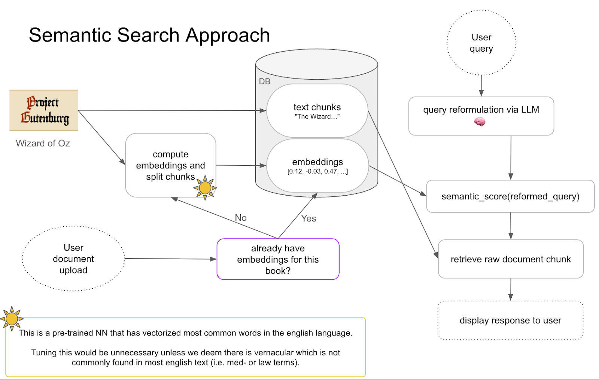

# Readiscover  
**Trustworthy Passage Retrieval for Long-Form Fiction**

  

Readiscover is a semantic search system for **extracting verifiable passages from book-length texts**.  
It was built to support editorial workflows where **hallucinations are unacceptable** and answers must be **traceable to the source**.

This project compares an embedding-based retrieval pipeline against an LLM extraction baseline and evaluates accuracy, ranking quality, and failure modes.

---

## Why This Project Exists

LLMs are good at *sounding right*?... but bad at **quoting long documents reliably**.

In editorial and legal contexts, hallucinated passages break trust. Readiscover reframes the problem from *generation* to **retrieval**, returning only continuous, verbatim excerpts from the source text.

---

## What We Built

### Semantic Retrieval Pipeline
- Parsed and cleaned raw HTML books
- Paragraph aware chunking with configurable overlap
- Dense embeddings optimized for document retrieval
- Cosine-similarity search returning top-K passages
- Deterministic, reproducible results (no hallucinations)

### LLM Baseline (for Comparison)
- Custom GPT prompted to extract verbatim passages
- Full-text access provided
- Hallucinations detected and logged
- Used as a strong real-world baseline

  

---

## Tech Stack

- **Python**
- **BeautifulSoup** – HTML parsing
- **Google Vertex AI** – dense text embeddings
- **LLMs** – query reformulation & baseline extraction
- **NumPy / Pandas** – similarity scoring & evaluation
- **Matplotlib** – analysis and visualization

---

## Dataset

- Public-domain *Wizard of Oz* series (8 books)
- Hundreds of characters, locations, and events
- Natural-language questions modeled after real editorial queries
- Gold-standard passages identified manually for evaluation

---

## Key Results

| Metric | Readiscover | LLM (hallucinations removed) |
|------|------------|------------------------------|
| Top-3 Accuracy | 34% | 44% |
| Mean Reciprocal Rank | 0.25 | 0.40 |
| Mean Passage Distance | **18.6** | 25.7 |
| Hallucination Rate | **0%** | **43.6%** |

**Takeaways:**
- LLMs can be accurate, but only after heavy filtering
- Nearly half of LLM outputs contained hallucinated text
- Readiscover consistently retrieved passages **closer to the true answer**
- Retrieval failures were transparent and easy to audit

---

## Why This Matters in Production

✔ No hallucinations  
✔ Deterministic outputs  
✔ Auditable failure modes  
✔ Safer for editorial, legal, and research workflows  

This system favors **trust and interpretability** over fluency

---

## My Role

- Designed and implemented the **LLM extraction baseline**
- Built evaluation workflows and metrics
- Created result visualizations
- Contributed to UX design and passage classification
- Collaborated on system design and analysis

---

## Limitations & Next Steps

**Current limitations**
- Single-passage retrieval only
- No cross-passage reasoning or synthesis

**Planned improvements**
- EPUB / Word document ingestion
- Human-in-the-loop feedback
- Hybrid retrieval with LLM-based reranking
- Lexical + semantic ensemble (BM25 + embeddings)

---

## Academic Context

Capstone Project — Master of Applied Data Science  
University of Michigan, School of Information

---

## License

The original work was completed as a [collaborative academic project](https://github.com/zymoncone/readiscoverers-backend).  
This repository highlights **semantic search systems, LLM query reformulation, and paragraph aware chunking** for portfolio purposes.

